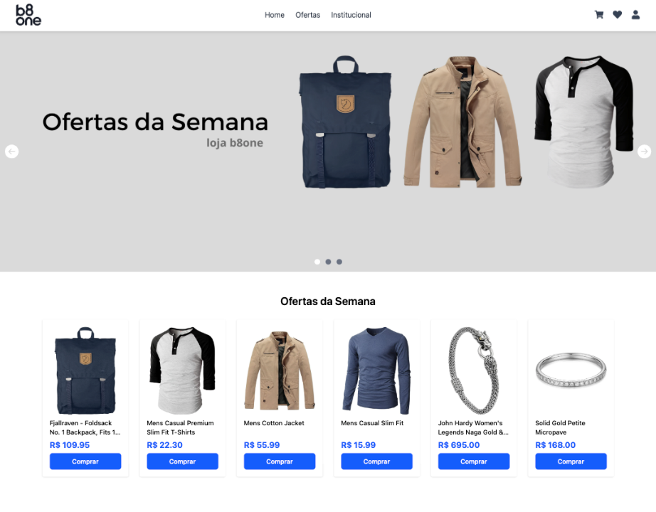

# 🛒 Projeto Front-End - E-commerce B8one

Este projeto foi desenvolvido como desafio técnico para a vaga de Desenvolvedor Front-End na **B8one**.
O projeto simula uma vitrine de ofertas da semana para um e-commerce. Possui um carrossel de banners responsivo, uma grade de produtos consumida via API externa e páginas institucionais com roteamento pelo React Router.

## 🚀 Tecnologias Utilizadas

- **React** + **Vite**
- **TypeScript**
- **Tailwind CSS** – estilização rápida e responsiva
- **React Icons** – ícones acessíveis
- **React Router DOM** – navegação entre páginas
- **Vercel** – deploy contínuo e gratuito
- **API FakeStore** – consumo de dados reais de produtos para simular um e-commerce

## 📱 Responsividade

Todo o layout foi desenvolvido com foco em **responsividade**.  
Utilizei classes do Tailwind como `sm:`, `md:`, `lg:` para adaptar o conteúdo para diferentes tamanhos de tela.

- Banners possuem versões desktop e mobile que são renderizadas dinamicamente com base na largura da tela.
- Grade de produtos responsiva que se adapta a 2 colunas no mobile e até 6 colunas em telas maiores.

## 🔍 Foco em SEO e Boas Práticas

Mesmo sendo uma SPA com React, apliquei práticas que ajudam na performance e indexação:

- Uso de **HTML semântico** (`<main>`, `<section>`, `<h1>`, etc.)
- Atributos `alt` descritivos em imagens
- Componentização para melhor manutenção
- Mobile-first design para otimização em Core Web Vitals

### 🧩 Principais Funcionalidades

- Carrossel de banners com navegação por setas e indicadores
- Lista de produtos consumida de API externa
- Utilização de hook customizado para detecção de viewport
- Botão de "Adicionar ao Carrinho"
- Roteamento entre `/`, `/ofertas` e `/institucional`
- Deploy realizado na Vercel

## 🌐 Deploy

Projeto está disponível em produção na **Vercel**:  
🔗 [https://ecommerce-b8one.vercel.app](https://ecommerce-b8one.vercel.app)

## 🖼️ Prints do Projeto

### 💻 Versão Desktop

### 📱 Versão Mobile

